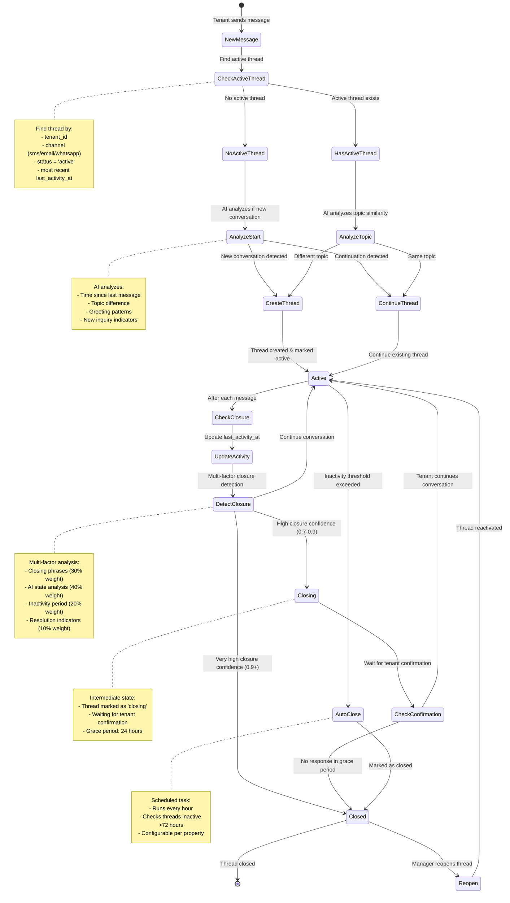

# Conversation Lifecycle Flow Diagram



## Conversation Lifecycle States

| State         | Description                                        | Triggers                                        | Transitions                                               |
| ------------- | -------------------------------------------------- | ----------------------------------------------- | --------------------------------------------------------- |
| **New**       | Initial state before thread creation               | Tenant sends first message                      | → Active                                                  |
| **Active**    | Ongoing conversation, tenant engaged               | Thread created or reopened                      | → Closing, Closed, AutoClose                              |
| **Closing**   | High probability of closure, awaiting confirmation | Closure confidence 0.7-0.9                      | → Active (tenant responds), Closed (grace period expires) |
| **Closed**    | Conversation ended, no further activity expected   | Closure confidence 0.9+ or grace period expires | → Reopen (manager action)                                 |
| **Resolved**  | Issue resolved, conversation concluded             | Tenant confirms resolution                      | → Closed (inactivity)                                     |
| **Escalated** | Requires manager intervention                      | AI detects escalation                           | → Active (manager responds)                               |

## Closure Detection Factors

### 1. Closing Phrases (30% weight)

- **Strong closings** (0.9 score):
  - "thank you", "thanks again", "appreciate your help"
  - "problem solved", "all set", "that works perfectly"
  - "goodbye", "talk to you later"

- **Moderate closings** (0.6 score):
  - "thanks", "ok", "got it", "understood"
  - "perfect", "great", "sounds good"
  - "that helps", "good to know"

### 2. AI State Analysis (40% weight)

AI analyzes if conversation has reached natural conclusion:

- Tenant's issue addressed or resolved
- AI provided solution or next steps
- Tenant confirmed understanding or satisfaction
- No pending questions or follow-ups
- Maintenance request created/updated
- Action items completed

### 3. Inactivity Period (20% weight)

- 24+ hours inactive: 0.5 score
- 48+ hours inactive: 0.8 score
- 72+ hours inactive: 1.0 score (configurable)

### 4. Resolution Indicators (10% weight)

- "issue resolved" in AI response
- "problem fixed" in AI response
- "solution provided" in AI response
- "ticket created" in AI response
- "maintenance scheduled" in AI response

## Event Timeline Example

```
Tenant: "My sink is leaking"
  ↓
[Thread Created] Status: Active, Subject: "Leaky sink"
  ↓
AI: "I understand you have a leaky sink. I'll create a maintenance request..."
  ↓
Tenant: "Thanks, when will someone come?"
  ↓
[Thread Updated] Status: Active (continuing same topic)
  ↓
AI: "Our maintenance team will contact you within 24 hours..."
  ↓
Tenant: "Great, thanks for your help!"
  ↓
[Closure Detection] Factors:
  - Closing phrases: 0.9 (thanks)
  - AI analysis: 0.8 (issue addressed)
  - Inactivity: 0.0 (recent activity)
  - Resolution indicators: 0.6 (solution provided)
  - Total: 0.78
  ↓
[Thread Status] Status: Closing (confidence: 0.78)
  ↓
[Grace Period] 24 hours wait for tenant response
  ↓
[No Response] Tenant doesn't message
  ↓
[Thread Closed] Status: Closed, closed_at: timestamp
```

## Manager Controls

### Manual Actions

1. **Mark as Closing**
   - Sets status to 'closing'
   - Starts grace period
   - Logs manager action

2. **Force Close**
   - Sets status to 'closed'
   - Sets closed_at timestamp
   - Records closure reason

3. **Reopen Thread**
   - Sets status back to 'active'
   - Clears closed_at timestamp
   - Logs reopen reason

### Dashboard Indicators

- **Status Badge**: Color-coded badge with icon
- **Closure Confidence**: Percentage with details
- **Activity Timeline**: Start, last activity, resolved, closed
- **Action Buttons**: Context-aware based on status
